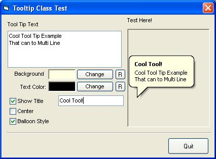



## API MultiLine ToolTip Class

### Description

Based on other code found on the web, i created this class (CToolTip.cls). Very simple to use, this class allows you to create multi-line and "Bubble" style tooltips that you can attach to any control (with a hWnd property)

This is Not just a copy of other code found on this site, this class takes a slightly different approach to tooltips - an approach that made more sense to my application. eg passing just the hWnd of the control you wish to apply the tooltip rather than the control its self, strongly typed variables, and completely encapsulation. This class (with the exception of the error handling) is identicle to the class im using in some of my commercially written applications, so its already been tested

[any bugs let me know :)]

Use it but dont abuse it - im fed up of reading harsh comments on PSC for perfectly good example code.
 
### More Info
 
Great looking tooltips!

             |
---                |---
**Submitted On**   |2002-06-07 10:39:32
**By**             |[Joe Bourne](https://github.com/Planet-Source-Code/PSCIndex/blob/master/ByAuthor/joe-bourne.md)
**Level**          |Intermediate
**User Rating**    |4.8 (38 globes from 8 users)
**Compatibility**  |VB 5\.0, VB 6\.0
**Category**       |[Miscellaneous](https://github.com/Planet-Source-Code/PSCIndex/blob/master/ByCategory/miscellaneous__1-1.md)
**World**          |[Visual Basic](https://github.com/Planet-Source-Code/PSCIndex/blob/master/ByWorld/visual-basic.md)
**Archive File**   |[API\_Multi\_91335672002\.zip](https://github.com/Planet-Source-Code/joe-bourne-api-multiline-tooltip-class__1-35572/archive/master.zip)

### API Declarations

a few, but encapsulated in a reusable class

